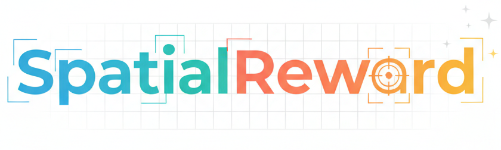
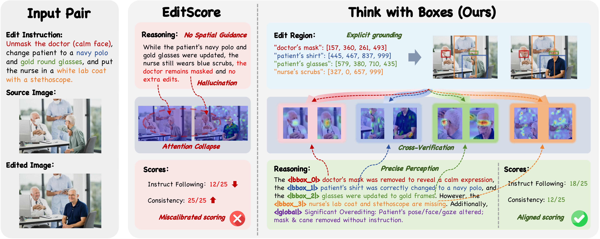

<p align="center">
  
</p>

<p align="center">
  <a href="https://lorangan-ddup.github.io/SpatialReward/"></a>
  <a href="https://arxiv.org/abs/2602.07458"></a>
  <a href="https://huggingface.co/SpatialReward/SpatialReward-8B"></a>
  <a href="https://huggingface.co/datasets/SpatialReward/MER-Bench"></a>
  <a href="https://huggingface.co/datasets/SpatialReward/SpatialReward-Train"></a>
</p>

<h4 align="center">
    <p>
        <a href=#-news>News</a> |
        <a href=#-quick-start>Quick Start</a> |
        <a href=#-benchmark-evaluation>Benchmark Usage</a> |
        <a href=#️-citing-us>Citation</a>
    <p>
</h4>


**SpatialReward** is a state-of-the-art reward model for instruction-guided image editing that addresses the critical "Attention Collapse" problem through explicit spatial reasoning. By anchoring semantic judgments to predicted edit regions via bounding boxes, SpatialReward achieves unprecedented accuracy and reliability as both an evaluator and RL training signal.

<p align="center">
  
  <br>
  <em>Visualizing the Attention Collapse problem vs. SpatialReward's spatial grounding.</em>
</p>

## 🔥 News

- **2026-05-05**: 🎉 We have open-sourced the **[SpatialReward-8B](https://huggingface.co/SpatialReward/SpatialReward-8B)** model weights, **[MER-Bench](https://huggingface.co/datasets/SpatialReward/MER-Bench)** benchmark, and **[SpatialReward-Train](https://huggingface.co/datasets/SpatialReward/SpatialReward-Train)** (260k spatial-aware training data)!
- **2026-05-01**: 🎉 **SpatialReward** has been accepted to **ICML 2026**!
- **2026-02-12**: We have released the **inference code**, **reward server**, and **training configurations**!
- **2026-02-07**: The paper is available on [arXiv](https://arxiv.org/abs/2602.07458).

## 📌 TODO

- [x] Release SpatialReward model weights (Qwen3-VL-8B)
- [x] Release MERBench dataset
- [x] Release SpatialReward-Data (260k spatial-aware training data)

## 🚀 Quick Start

### 🛠️ Environment Setup

#### Prerequisites

- Python 3.11+
- PyTorch 2.8.0+ with CUDA 12.1+

#### Installation

```bash
git clone https://github.com/Kwai-Keye/SpatialReward.git
cd SpatialReward

conda create -n spatialreward python=3.11 -y
conda activate spatialreward

pip install torch==2.8.0 torchvision --extra-index-url https://download.pytorch.org/whl/cu126

pip install -r requirements.txt
```

## 📚 Datasets

| Dataset | Description | Link |
|---|---|---|
| **MER-Bench** | MultiEditReward-Bench evaluation benchmark | [🤗 Hub](https://huggingface.co/datasets/SpatialReward/MER-Bench) |
| **SpatialReward-Train** | 260k spatial-aware training data (SFT + RL) | [🤗 Hub](https://huggingface.co/datasets/SpatialReward/SpatialReward-Train) |

---

## 📊 Benchmark Evaluation

We provide evaluation scripts for **MERBench**, **MMRB2**, and **EditReward-Bench**. The environment setup is already covered by the main `requirements.txt`, and all parameters are pre-configured in the scripts.

### 1. MERBench
```bash
bash eval/MERBench/run.sh
```

> **Note**: For closed-source models (e.g., GPT, Gemini), we provide an API inference script in `eval/MERBench/api_eval`. See `eval/MERBench/run.sh` and `eval/MERBench/api_eval/inference.py` for details.

### 2. MMRB2
```bash
bash eval/MMRB2/run.sh
```

### 3. EditReward-Bench
```bash
bash eval/EditReward-Bench/run.sh
```
---

## 🖥️ Reward Server Setup

For detailed documentation on the reward server architecture and API, please refer to [example/reward/README.md](example/reward/README.md).

We provide a distributed reward server implementation to support high-throughput inference for RL training.

### 1. Start Support Servers

Start the worker servers on your GPU machines. This script will automatically assign available GPUs to workers.

```bash
cd example/reward/server
bash start_servers.sh
```

### 2. Start Proxy Server

Start the proxy server, which acts as a load balancer and single entry point for clients.

```bash
cd example/reward/server
bash start_proxy.sh
```

### 3. Client Usage

We provide a sample client implementation in `example/reward/client/reward_client_edit.py`. You can refer to this file to implement your own client logic or use it directly if applicable.

```python
# Example of using the client class
# Note: Ensure the example directory is in your PYTHONPATH
from example.reward.client.reward_client_edit import RewardClient

# Initialize client (connects to proxy server)
client = RewardClient(proxy_host="127.0.0.1", proxy_port=23456)

# Perform evaluation
# Input images should be PIL Image objects or bytes
scores, rewards, reasoning, meta_data = client.evaluate(
    input_images=[input_img], 
    output_image=[output_img], 
    meta_datas=[{"instruction": "Remove the dog"}]
)
```

## 🎯 Training

We provide efficient training implementations based on [LLaMA-Factory](https://github.com/hiyouga/LLaMA-Factory) (for SFT) and [ms-swift](https://github.com/modelscope/ms-swift) (for RL).

### 1. Supervised Fine-Tuning (SFT)

For SFT, we utilize the **LLaMA-Factory** framework. Please use the following configuration file:
- **Config**: [`example/SpatialReward-train/sft/qwen3vl_lora_spatial_reward.yaml`](example/SpatialReward-train/sft/qwen3vl_lora_spatial_reward.yaml)

```bash
# Example usage with llamafactory-cli
llamafactory-cli train example/SpatialReward-train/sft/qwen3vl_lora_spatial_reward.yaml
```

---

### 2. Reinforcement Learning (RL)

For RL, we utilize the **ms-swift** framework.

**Setup**:
1.  **Replace ORM**: Replace `ms-swift/swift/plugin/orm.py` with our provided implementation: [`example/SpatialReward-train/rl/orm.py`](example/SpatialReward-train/rl/orm.py).
2.  **Configure API**: Configure your API keys and endpoints in the new `orm.py`.

**Run Training**:
Use the provided script to start training.
> **Note**: This script is configured for a 4-node setup. You will need to create scripts for other nodes (by changing `NODE_RANK` and `MASTER_ADDR` as appropriate).

```bash
bash example/SpatialReward-train/rl/run_mater.sh
```

## 🙏 Acknowledgements

We would like to thank the [EditScore](https://github.com/VectorSpaceLab/EditScore) and [EditReward](https://github.com/TIGER-AI-Lab/EditReward) for providing valuable references.


## ❤️ Citing Us

If you find this repository or our work useful, please consider giving a star ⭐ and citation 🦖:

```bibtex
@article{long2026spatialreward,
  title={SpatialReward: Bridging the Perception Gap in Online RL for Image Editing via Explicit Spatial Reasoning},
  author={Long, Yancheng and Yang, Yankai and Wei, Hongyang and Chen, Wei and Zhang, Tianke and Fan, Haonan and Liu, Changyi and Jiang, Kaiyu and Chen, Jiankang and Tang, Kaiyu and Wen, Bin and Yang, Fan and Gao, Tingting and Li, Han and Yang, Shuo},
  journal={arXiv preprint arXiv:2602.07458},
  year={2026}
}
```
